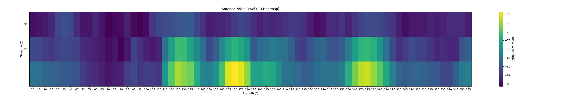
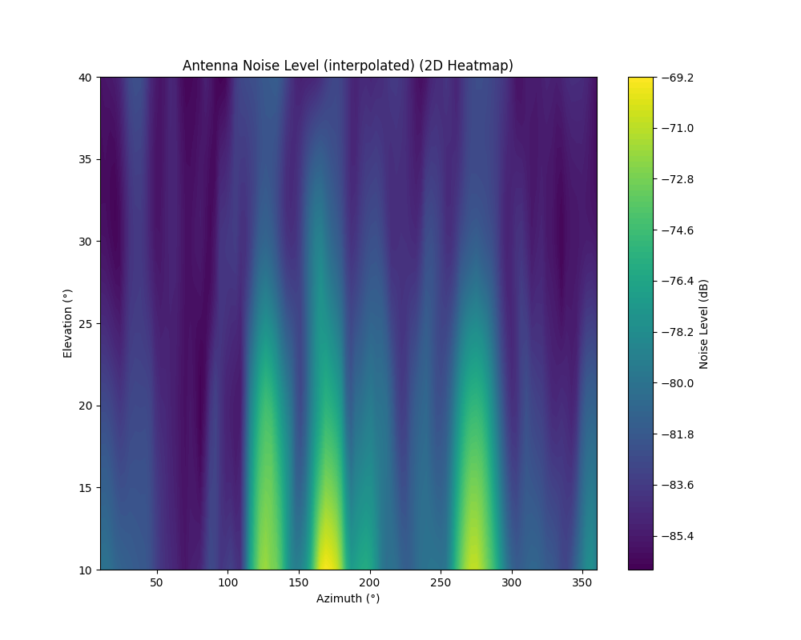
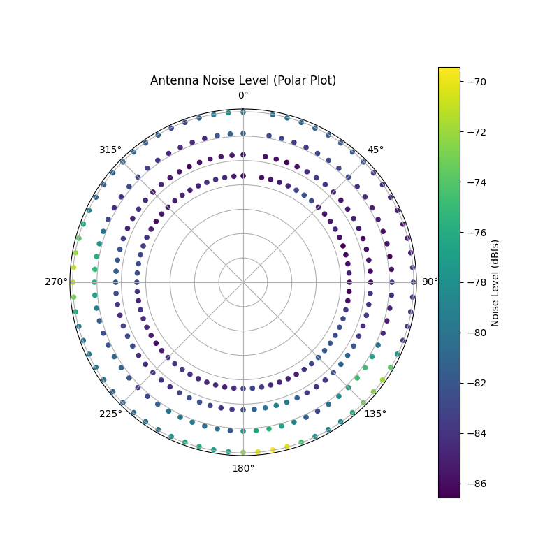
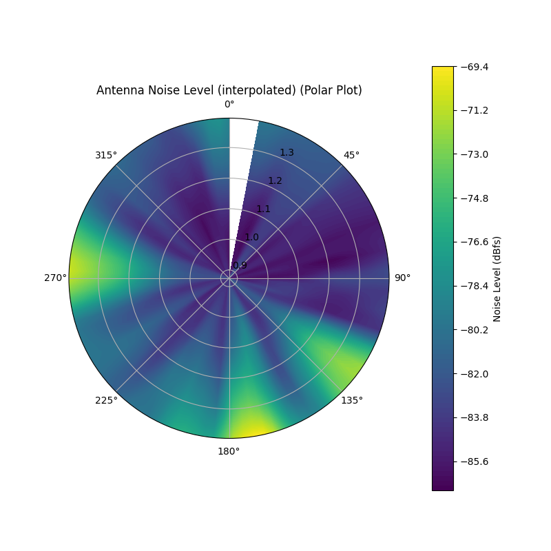

# Noise Mapper
This is a simple program that was used in CS5CEP to meausere the noise level around the antena location. Multiple plots were generated to show the noise level in different directions. The program was written in Python and used the matplotlib library to generate the plots

It will connect to gqrx via socket to gather the necessary information. It will use the dbfs value as measurments. Please make sure that you have gqrx running with the correct frequency, bandwidth and filter settings before running the program

It will control the antena via rotctl. It will move the antena to a certain position, wait a couple of seconds for the antena to reach the position. Wait some extra seconds to gather a few measurments and then move to the next position.

## How to use
Make sure that you change the parameters at the start of the `noiseImager.py` file to match your setup and the angles/resolution you want to scan at.

After that, you can simply run the program using `python noiseImager.py` and the program will gather data and save it to a json file

At the end of the scan, it will show a quick 3d plot of the data

After the data has been gathered, you can generate the images by running `image_maker.py`. By default it will generate the images for the latest file. but you can pass via the command line the file you want to generate the images for.

## Examples
Here are some examples of the generated plots

## In the future
- [ ] create a test that will get the data to plot the whole specterum over angles 
    - for this gqrx needs to support remove raw file recording
- [ ] Add files to parameter file
- [ ] Add max and min angles for azimuth and elevation
- [ ] pipeline to automate testing over time
- [ ] add proper logging
- [ ] better error handling 